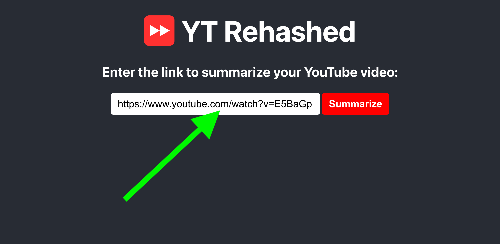
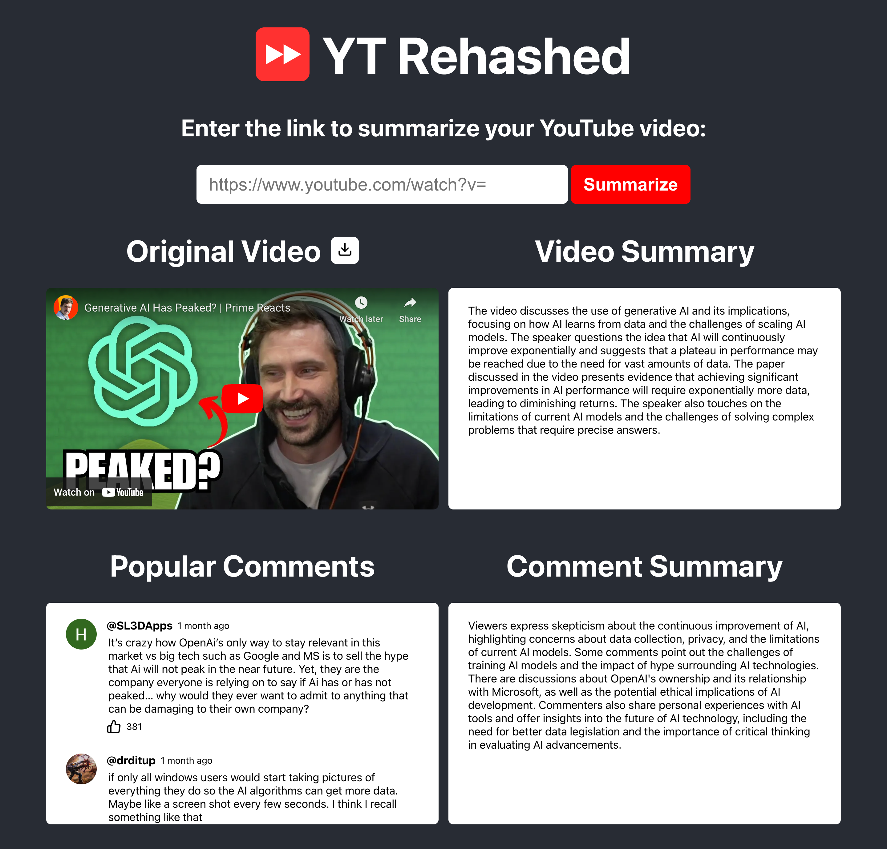
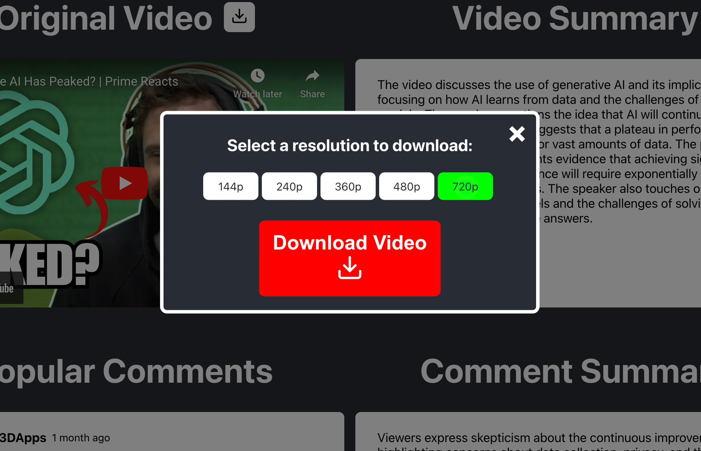

# YT Rehashed

An AI tool to quickly generate quality summaries of YouTube videos. Summarize your videos here: [ytrehashed.com](ytrehashed.com)

## Table of Contents

1. [Introduction](#introduction)
2. [Features](#features)
4. [Usage](#usage)
4. [Installation](#installation)
5. [Contact](#contact)

## Introduction

This full-stack React-Flask web application is designed to help users quickly grasp the content of YouTube videos through summaries generated with the help of OpenAI's API and ChatGPT-3.5-turbo. This tool is especially useful for students, researchers, and anyone who wants to save time while consuming long-form video content.

## Features

- Summarizes videos with only a link
- Displays original video next to the video summary
- Video downloader to download original video at the available resolutions
- Supports all lengths of Youtube videos up to 1 hour
- Generates a summary of the top 100 popular comments
- Displays the original comments section next to the comment summary

## Usage

### 1. Enter the link of your YouTube video



### 2. After about 5-10 seconds, the original video, comments, and summaries will show up.



### 3. Download the original video at different resolutions.



## Installation

Follow these steps to set up YT Rehashed locally:

#### 1. Clone the repository

`git clone https://github.com/asshelke/yt-rehashed.git`

#### 2. Navigate to the client directory (frontend)

`cd client`

#### 3. Install all necessary React dependencies

`npm install`

#### 4. Start the React frontend server

`npm start`

#### 5. Navigate to the server directory (backend)

`cd server`

#### 6. Install all necessary Python dependencies

`pip install -r requirements.txt`

#### 7. Obtain an OpenAI API Key

https://platform.openai.com/api-keys

> IMPORTANT: You need to deposit some money into your OpenAI account to use the API.

#### 8. Add an environment variable for the key in a .env file

`OPENAI_API_KEY=your_api_key`

> NOTE: Make sure to place the `.env` file in the `/server/` directory.

#### 9. Create an AWS S3 Bucket

https://aws.amazon.com/s3/

#### 10. Collect values for the following environment variables and add them

```
AWS_ACCESS_KEY_ID=your_access_key_id
AWS_SECRET_ACCESS_KEY=your_secret_access_key
AWS_S3_BUCKET_NAME=your_bucket_name
AWS_S3_REGION=your_region
```

#### 11. Add the following bucket policy for your AWS S3 bucket

```
{
  "Version": "2012-10-17",
  "Statement": [
    {
      "Effect": "Allow",
      "Principal": {
        "AWS": "arn:aws:iam::your-account-id:user/your-iam-user"
      },
      "Action": [
        "s3:PutObject",
        "s3:GetObject",
        "s3:ListBucket"
      ],
      "Resource": [
        "arn:aws:s3:::your-s3-bucket-name",
        "arn:aws:s3:::your-s3-bucket-name/*"
      ]
    }
  ]
}
```

#### 12. Start the Flask backend server

`python app.py`

#### 13. View the website locally

http://localhost:3000

## Contact

Aryan Shelke

Email: aryan.shelke.2003.@gmail.com

LinkedIn: [linkedin.com/in/aryanshelke](linkedin.com/in/aryanshelke)