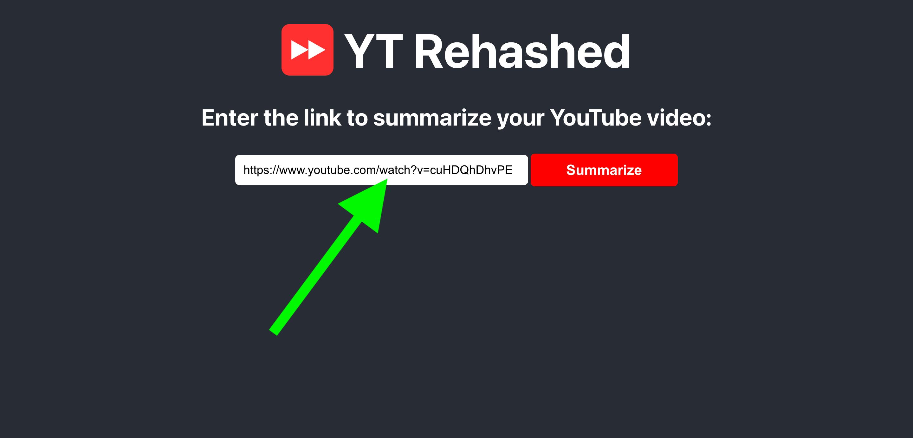

# YT Rehashed

A tool to quickly generate quality summaries of YouTube videos. Summarize your videos here: [ytrehashed.com](ytrehashed.com)

## Table of Contents

1. [Introduction](#introduction)
2. [Features](#features)
4. [Usage](#usage)
4. [Installation](#installation)
5. [Contact](#contact)

## Introduction

This fullstack React-Flask web application is designed to help users quickly grasp the content of YouTube videos through summarizes generated with the help of OpenAI's API and ChatGPT-3.5-turbo. This tool is especially useful for students, researchers, and anyone who wants to save time while consuming long-form video content.

## Features

- Summarizes videos with only a link (no transcript needed)
- Supports all lengths of Youtube videos up to 1 hour
- Displays original video next to summary

## Usage

Enter the link of your YouTube video and wait about 5-10 seconds for the video and summary to show up.

## Installation

Follow these steps to set up YT Rehashed locally:

#### 1. Clone the repository

`git clone https://github.com/asshelke/yt-rehashed.git`

#### 2. Navigate to the client directory

`cd client`

#### 3. Start the React frontend server

`npm start`

#### 4. Navigate to the server directory

`cd server`

#### 5. Install all necessary Python dependencies

`pip install -r requirements.txt`

#### 6. Start the Flask backend server

`python app.py`

#### 7. Obtain an OpenAI API Key

https://platform.openai.com/api-keys

> IMPORTANT: You will need to deposit some money into your OpenAI account to use the API.

#### 8. Add an environment variable for the key in a .env file

`OPENAI_API_KEY=[add your key here]`

> NOTE: Make sure to place the `.env` file in the `/server/` directory.

#### 9. View the website locally

http://localhost:3000

## Contact

Aryan Shelke

Email: aryan.shelke.2003.@gmail.com

LinkedIn: [linkedin.com/in/aryanshelke](linkedin.com/in/aryanshelke)
